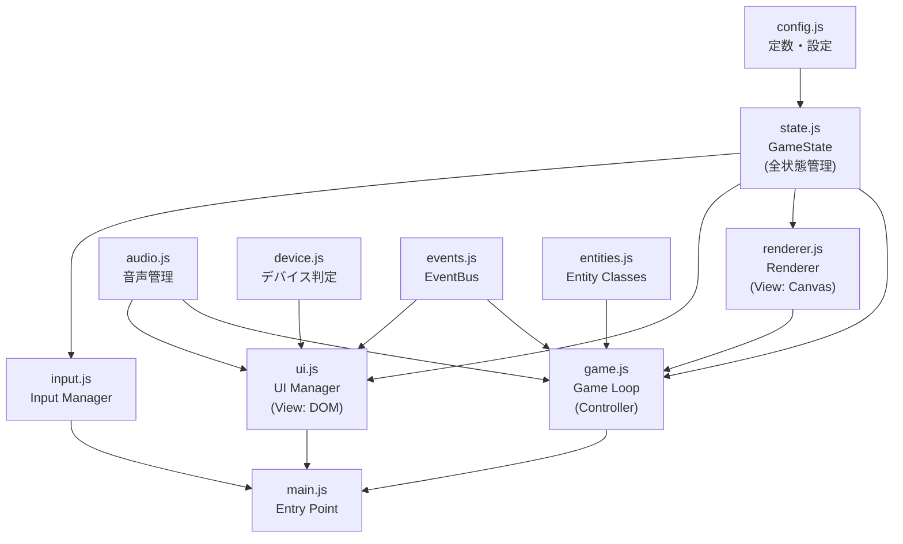

# 煩悩シューティング

修行僧が迫り来る「煩悩」を「読経」で撃ち落とす、ブラウザベースのシューティングゲームです。
PCとスマートフォンの両方に対応しており、単純ながらも奥深いゲームプレイを楽しめます。

## 🎮 ゲーム概要

プレイヤーは修行僧となり、空から降ってくる「煩悩（文字）」を「読経（ショット）」で浄化します。
精神力（HP）が尽きる前に、より多くの徳を積み、高スコアを目指しましょう。

## ✨ 特徴

*   **クロスプラットフォーム**: PC（キーボード）とモバイル（タッチ操作）の両方に完全対応。
*   **レベルシステム**: 「仏性Lev1（Easy）」から「悪魔（Demon）」まで、幅広い難易度を用意。
*   **必殺技**: 徳（MP）を貯めて放つ「煩悩即菩薩」で一発逆転。
*   **修行の軌跡機能**: ローカル保存によるハイスコアランキングに対応。
*   **隠し要素**: 特定の条件で解放される高難易度モード。

## 🕹️ 操作方法

### PC（キーボード操作）
*   **移動**: `←` `→` キー
*   **読経（ショット）**: `Space` キー
*   **必殺技（煩悩即菩薩）**: `Z` キー（MP満タン時）

### スマートフォン（タッチ操作）
*   画面上に表示される仮想ボタンを使用します。
*   **左右ボタン**: 移動
*   **ショットボタン**: 読経
*   **必殺技ボタン**: 必殺技発動

## 🚀 始め方

特別なインストールは不要です。ブラウザがあればすぐに遊べます。

1.  このリポジトリをダウンロードまたはクローンします。
2.  フォルダ内の `index.html` をブラウザ（Chrome, Safari, Edgeなど）で開いてください。

## 🛠️ 技術スタック

*   **HTML5**: フレームワーク不使用
*   **CSS3**: フレームワーク不使用
*   **JavaScript (ES6+)**: Vanilla JS（ライブラリ不使用）

## 🏗️ アーキテクチャ

MVC (Model-View-Controller) パターンに基づき、状態管理 (`state.js`) と描画ロジック (`renderer.js`) を分離して設計しています。

## 📂 ディレクトリ構成

*   `index.html`: ゲームのメインファイル
*   `assets/`: JS、CSSファイル
*   `images/`: ゲーム内で使用する画像素材
*   `sounds/`: BGMおよび効果音

---
Enjoy your ascetic practice!
