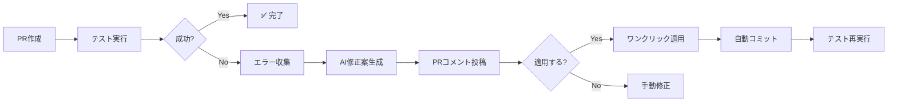

# AI自動修正システム

テストが失敗した時に、AIが自動で修正案を生成してPRにコメント投稿し、ワンクリックで適用できるシステムです。

## 🎯 概要



## 📋 機能

### 1. 自動エラー検出

テストが失敗すると、以下のエラー情報を自動収集:

- **HTMLバリデーションエラー**
  - 行番号
  - エラーメッセージ
  - 重要度（Error/Warning）

- **アクセシビリティ違反**
  - 違反ID
  - 影響度（Critical/Serious/Moderate/Minor）
  - 該当要素
  - 修正方法へのリンク

### 2. AI修正案生成

Gemini APIを使用して、具体的な修正案を生成:

- エラーの説明
- 修正方法の提案
- 修正後のコード例
- 参考リンク

### 3. PRコメント自動投稿

生成された修正案をPRに自動コメント:

```markdown
## 🤖 AI自動修正提案

テストで問題が検出されました。以下の修正案を確認してください。

---

### 🔧 修正が必要な箇所

1. **HTMLバリデーションエラー (行123)**
   - 問題: タグが閉じられていません
   - 修正方法: </div>を追加
   - 修正例:
   ```html
   <div class="container">
     <!-- content -->
   </div>
   ```

---

### ✨ ワンクリック適用

[手順を表示]

---

<details>
<summary>📊 エラーサマリー</summary>

- HTMLバリデーションエラー: 2
- アクセシビリティ違反: 3

</details>
```

### 4. ワンクリック適用

修正を自動で適用するワークフロー:

1. GitHub Actionsの「Apply Auto-Fix」ワークフローを開く
2. PR番号とRun IDを入力
3. "Run workflow"をクリック
4. 自動でコミット＆Push
5. テストが再実行される

## 🚀 使い方

### 通常のフロー

1. **PRを作成**
   ```bash
   git checkout -b feature/new-feature
   git commit -m "Add new feature"
   git push origin feature/new-feature
   gh pr create
   ```

2. **テストが自動実行**
   - GitHub Actionsが自動的にテストを実行

3. **テスト失敗時**
   - AIが修正案を生成
   - PRに自動コメントが投稿される

4. **修正案を確認**
   - PRのコメントを確認
   - 修正内容が適切か判断

5. **ワンクリック適用 または 手動修正**
   
   **Option A: ワンクリック適用**
   1. [Actions](../../actions/workflows/apply-fix.yml)タブを開く
   2. "Run workflow"をクリック
   3. PR番号とRun IDを入力
   4. 実行
   
   **Option B: 手動修正**
   ```bash
   # 修正案を参考に手動で修正
   git add .
   git commit -m "fix: apply suggested fixes"
   git push
   ```

6. **テスト再実行**
   - 修正後、テストが自動で再実行される

## 🔧 技術詳細

### エラー収集

#### HTML Validation
- **スクリプト**: `.github/scripts/collect_html_errors.sh`
- **入力**: `vnu_output.txt` (vnu.jarの出力)
- **出力**: `html_errors.json`

```json
{
  "test_type": "html_validation",
  "errors": [
    {
      "severity": "error",
      "message": "Unclosed tag",
      "line": 123,
      "column": 45
    }
  ],
  "success": false,
  "total_errors": 1,
  "total_warnings": 0
}
```

#### Accessibility
- **スクリプト**: `.github/scripts/collect_accessibility_errors.js`
- **入力**: `accessibility-report.json` (axe-coreの出力)
- **出力**: `accessibility_errors.json`

```json
{
  "test_type": "accessibility",
  "errors": [
    {
      "id": "button-name",
      "impact": "critical",
      "description": "Buttons must have discernible text",
      "help": "Button text must be discernible",
      "helpUrl": "https://...",
      "html": "<button></button>",
      "target": ["#submit-btn"]
    }
  ],
  "success": false,
  "total_violations": 1
}
```

### AI修正案生成

- **スクリプト**: `.github/scripts/generate_fix_suggestions.py`
- **API**: Gemini 2.0 Flash Exp
- **入力**: エラー情報 + ファイル内容
- **出力**: `fix_suggestions.json`

```json
{
  "has_fixes": true,
  "suggestions": "### 🔧 修正が必要な箇所\n\n...",
  "error_summary": {
    "html_errors": 1,
    "accessibility_errors": 1
  }
}
```

### 修正適用

- **スクリプト**: `.github/scripts/apply_fixes.py`
- **API**: Gemini 2.0 Flash Exp
- **処理**:
  1. 修正案を読み込み
  2. AIに実際のファイルへの適用を依頼
  3. 修正後のファイルを保存
  4. コミット＆Push

## ⚙️ 設定

### 必要な環境変数

- `GEMINI_API_KEY`: Gemini APIキー（GitHub Secretsに設定）

### ワークフロー

#### test.yml
- テスト失敗時に`auto-fix`ジョブを実行
- PRの場合のみ動作（`github.event_name == 'pull_request'`）

#### apply-fix.yml
- 手動実行（`workflow_dispatch`）
- PR番号とRun IDを入力

## 🔒 セキュリティ

### APIキーの保護
- `GEMINI_API_KEY`はGitHub Secretsに保存
- PRコメントには表示されない

### 自動コミット
- ボット用のGitHub Tokenを使用
- コミットメッセージに`[auto-fix]`タグを付与
- 無限ループ防止のため、テストは再実行されるが自動修正は1回のみ

## 📊 制限事項

### 自動修正できないケース

以下の場合は手動修正が必要:

- 複雑なロジックエラー
- デザイン変更が必要な場合
- 複数ファイルにまたがる修正
- AIが適切な修正案を生成できない場合

### フォールバック

自動修正が失敗した場合:
1. エラーメッセージを表示
2. 手動修正の手順を提示
3. 関連ドキュメントへのリンクを提供

## 🐛 トラブルシューティング

### 修正案が生成されない

**原因**:
- `GEMINI_API_KEY`が設定されていない
- APIクォータを超過
- エラー情報の収集に失敗

**解決方法**:
1. GitHub Secretsで`GEMINI_API_KEY`を確認
2. Gemini APIの使用状況を確認
3. ワークフローログでエラーを確認

### PRコメントが投稿されない

**原因**:
- GitHub Tokenの権限不足
- PRではなくdirect pushの場合

**解決方法**:
1. ワークフローの`permissions`を確認
2. PRを作成してテストを実行

### ワンクリック適用が失敗する

**原因**:
- Run IDが間違っている
- アーティファクトが見つからない
- 修正内容が不正

**解決方法**:
1. 正しいRun IDを入力（テスト実行のURL末尾の数字）
2. アーティファクトが正しくアップロードされているか確認
3. 手動で修正を適用

## 📚 参考

- [Gemini API Documentation](https://ai.google.dev/docs)
- [GitHub Actions Documentation](https://docs.github.com/actions)
- [axe-core Rules](https://github.com/dequelabs/axe-core/blob/develop/doc/rule-descriptions.md)
- [Nu Html Checker](https://validator.github.io/validator/)

## 🎉 今後の改善案

- [ ] 複数ファイルの同時修正
- [ ] 修正履歴の記録
- [ ] 修正成功率の統計
- [ ] より高度なAI分析
- [ ] 自動テスト追加の提案
- [ ] Slackへの通知
